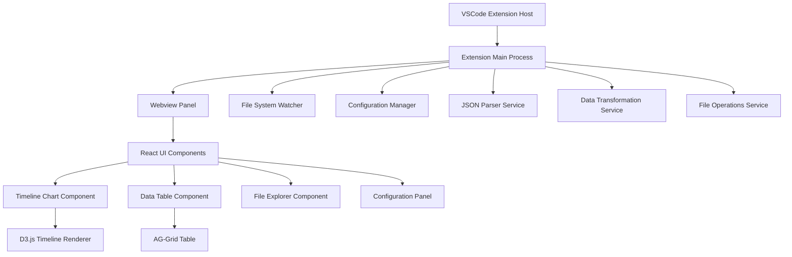

# Design Document

## Overview

The JSON Timeline Visualizer is a VSCode extension that provides interactive time series visualization and tabular editing capabilities for JSON array data. The extension uses a webview-based architecture with D3.js for charting, AG-Grid for tabular functionality, and a robust configuration system for flexible JSON path mapping.

## Architecture

### High-Level Architecture



### Extension Structure

- **Extension Host**: Main VSCode extension entry point
- **Webview Panel**: Custom UI rendered in VSCode webview
- **React Frontend**: Modern UI components for visualization and interaction
- **Service Layer**: Business logic for data processing and file operations
- **Configuration System**: Flexible JSON path mapping and user preferences

## Components and Interfaces

### 1. Extension Main Process

**Purpose**: Coordinates between VSCode API and webview, manages file operations

**Key Responsibilities**:
- Register commands and webview providers
- Handle file system operations and watching
- Manage extension lifecycle and state
- Bridge communication between VSCode and webview

**Interface**:
```typescript
interface ExtensionContext {
  activate(context: vscode.ExtensionContext): void;
  deactivate(): void;
  registerCommands(): void;
  createWebviewPanel(): vscode.WebviewPanel;
}
```

### 2. Configuration Manager

**Purpose**: Manages user configurations for JSON paths, visualization settings, and preferences

**Key Responsibilities**:
- Store and retrieve configuration settings
- Validate fluent path configurations
- Provide default configurations for common JSON structures
- Handle configuration persistence

**Interface**:
```typescript
interface ConfigurationManager {
  getArrayConfigs(): ArrayConfig[];
  setArrayConfig(config: ArrayConfig): void;
  validateFluentPath(path: string, json: any): boolean;
  getDefaultConfigs(): ArrayConfig[];
}

interface ArrayConfig {
  name: string;
  arrayPath: string;
  startDatePath: string;
  endDatePath: string;
  yAxisPath?: string;
  idPath?: string;
  color: string;
  enabled: boolean;
}
```

### 3. JSON Parser Service

**Purpose**: Parses JSON files and extracts data based on configured paths

**Key Responsibilities**:
- Parse JSON files safely with error handling
- Extract arrays using fluent path notation
- Transform date strings to Date objects
- Validate data integrity and structure

**Interface**:
```typescript
interface JsonParserService {
  parseFile(filePath: string): Promise<ParsedJsonData>;
  extractArrayData(json: any, config: ArrayConfig): TimelineEntity[];
  validateDateFormat(dateString: string): boolean;
  resolveFluentPath(obj: any, path: string): any;
}

interface TimelineEntity {
  id: string;
  startDate: Date;
  endDate: Date;
  yValue?: number;
  sourceArray: string;
  sourceFile: string;
  originalData: any;
}
```

### 4. Timeline Chart Component

**Purpose**: Renders interactive time series visualization using D3.js

**Key Responsibilities**:
- Render timeline blocks with proper scaling
- Handle zoom and pan interactions
- Update axis labels based on zoom level
- Manage color coding by array type
- Display tooltips and block labels

**Interface**:
```typescript
interface TimelineChartComponent {
  render(data: TimelineEntity[], config: ChartConfig): void;
  updateData(data: TimelineEntity[]): void;
  setZoomLevel(level: ZoomLevel): void;
  onBlockHover(callback: (entity: TimelineEntity) => void): void;
  onBlockClick(callback: (entity: TimelineEntity) => void): void;
}

interface ChartConfig {
  width: number;
  height: number;
  showLabels: boolean;
  tooltipFields: string[];
  dateFormat: string;
}
```

### 5. Data Table Component

**Purpose**: Provides editable tabular view with filtering using AG-Grid

**Key Responsibilities**:
- Display JSON data in tabular format
- Provide column filtering capabilities
- Enable cell editing functionality
- Sync filtering with timeline chart
- Handle save operations

**Interface**:
```typescript
interface DataTableComponent {
  setData(data: TimelineEntity[]): void;
  enableEditing(enabled: boolean): void;
  onFilterChange(callback: (filteredData: TimelineEntity[]) => void): void;
  onDataChange(callback: (changedData: TimelineEntity[]) => void): void;
  saveChanges(): Promise<void>;
}
```

### 6. File Explorer Component

**Purpose**: Manages directory browsing and file selection

**Key Responsibilities**:
- Display directory structure
- Provide file selection checkboxes
- Filter for JSON files only
- Handle file loading and unloading

**Interface**:
```typescript
interface FileExplorerComponent {
  loadDirectory(path: string): Promise<void>;
  onFileSelectionChange(callback: (selectedFiles: string[]) => void): void;
  refreshDirectory(): void;
  getSelectedFiles(): string[];
}
```

## Data Models

### Core Data Structures

```typescript
// Main data container
interface VisualizationData {
  entities: TimelineEntity[];
  configurations: ArrayConfig[];
  selectedFiles: string[];
  filterState: FilterState;
}

// Filter state management
interface FilterState {
  columnFilters: Record<string, any>;
  dateRange?: {
    start: Date;
    end: Date;
  };
  arrayTypes: string[];
}

// Chart interaction state
interface ChartState {
  zoomLevel: ZoomLevel;
  panOffset: number;
  selectedEntities: string[];
  hoveredEntity?: string;
}

enum ZoomLevel {
  YEARS = 'years',
  MONTHS = 'months', 
  WEEKS = 'weeks',
  DAYS = 'days',
  HOURS = 'hours'
}
```

### Configuration Schema

```typescript
// Extension settings schema
interface ExtensionSettings {
  defaultConfigurations: ArrayConfig[];
  chartSettings: {
    defaultHeight: number;
    colorPalette: string[];
    animationDuration: number;
  };
  tableSettings: {
    pageSize: number;
    enableEditing: boolean;
    autoSave: boolean;
  };
  fileSettings: {
    watchForChanges: boolean;
    maxFileSize: number;
    supportedExtensions: string[];
  };
}
```

## Error Handling

### Error Categories and Strategies

1. **File System Errors**
   - File not found: Display user-friendly message with file path
   - Permission denied: Guide user to check file permissions
   - File too large: Warn about performance implications

2. **JSON Parsing Errors**
   - Invalid JSON: Show syntax error location and suggestion
   - Missing properties: Highlight missing required paths
   - Type mismatches: Provide type conversion suggestions

3. **Configuration Errors**
   - Invalid fluent paths: Validate and suggest corrections
   - Missing required fields: Show configuration wizard
   - Circular references: Detect and prevent infinite loops

4. **Visualization Errors**
   - No data to display: Show helpful empty state
   - Date parsing failures: Highlight problematic entries
   - Performance issues: Implement data pagination and virtualization

### Error Recovery Mechanisms

```typescript
interface ErrorHandler {
  handleFileError(error: FileSystemError): void;
  handleParsingError(error: JsonParsingError): void;
  handleConfigurationError(error: ConfigurationError): void;
  showUserFriendlyMessage(error: Error): void;
}
```

## Testing Strategy

### Unit Testing

- **JSON Parser Service**: Test fluent path resolution, date parsing, data validation
- **Configuration Manager**: Test configuration validation, persistence, defaults
- **Data Transformation**: Test entity creation, filtering, sorting

### Integration Testing

- **File Operations**: Test file reading, writing, watching across different file systems
- **Webview Communication**: Test message passing between extension and webview
- **Configuration Flow**: Test end-to-end configuration setup and validation

### End-to-End Testing

- **User Workflows**: Test complete user journeys from file opening to visualization
- **Performance Testing**: Test with large datasets and multiple files
- **Cross-Platform Testing**: Ensure compatibility across Windows, macOS, and Linux

### Test Data Strategy

**Sample File Categories**:

1. **Simple Structure**: Single array with basic date properties
2. **Nested Structure**: Arrays nested 2-3 levels deep
3. **Multiple Arrays**: 3-5 different array types in one file
4. **Large Dataset**: 500+ entities for performance testing
5. **Edge Cases**: Empty arrays, missing dates, malformed data
6. **Real-World Examples**: Project timelines, deployment logs, resource schedules

**Configuration Test Scenarios**:

1. **Basic Config**: Simple date range visualization
2. **Complex Paths**: Deep nested property access
3. **Multiple Y-Axis**: Different integer attributes
4. **Custom ID Fields**: Various identifier configurations
5. **Tooltip Combinations**: Different tooltip field selections

### Performance Considerations

- **Data Virtualization**: Implement virtual scrolling for large datasets
- **Lazy Loading**: Load files on-demand rather than all at once
- **Debounced Updates**: Prevent excessive re-renders during interactions
- **Memory Management**: Clean up D3 elements and event listeners
- **Caching Strategy**: Cache parsed JSON data and transformed entities

### Accessibility Features

- **Keyboard Navigation**: Full keyboard support for all interactions
- **Screen Reader Support**: Proper ARIA labels and descriptions
- **High Contrast Mode**: Support for VSCode theme variations
- **Focus Management**: Clear focus indicators and logical tab order
- **Alternative Text**: Descriptive text for visual elements